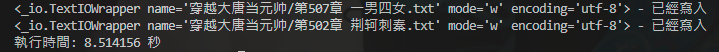
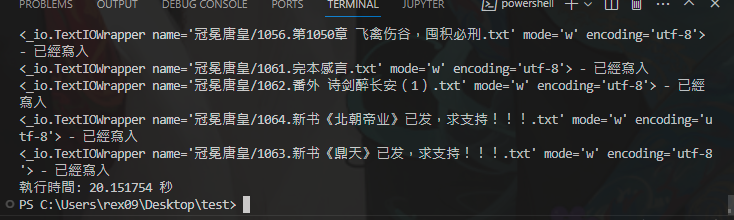
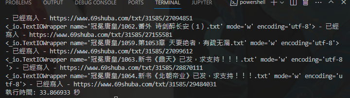

# 69-book-store-web-crawler
69書吧爬蟲

origin.py可以使用，不過爬下來是原始檔。

如果不想使用原始檔自己再做分割，那就使用`download.py`
使用`aiohttp`與`asyncio`打造的非同步網頁爬蟲。

目前打算找時間放入機器人內。
discord server: https://discord.gg/XUA89c4A

更：
測試結果，程式碼在上面自己可以改改看。
aiohttp-download.py 大概是 20s

thread_craw.py大概是 72s

pool_thread.py使用了`concurrent.futures`後，還是略輸`aiohttp`

查閱資料與商討來源：
1. [chatgpt](https://chat.openai.com/)
2. [[Python爬蟲教學]整合asyncio與aiohttp打造Python非同步網頁爬蟲](https://www.learncodewithmike.com/2020/09/python-asynchronous-scraper-using-asyncio-and-aiohttp.html)

copyright © xiaLotus corporation, all rights reserved.